## ** Chapters**

##[1. Basic Info ](#1-basic-info)
##[2. Table Create ](#ta)
##[1. Basic Info ](#1-basic-info)
##[1. Basic Info ](#1-basic-info)
##[1. Basic Info ](#1-basic-info)
##[1. Basic Info ](#1-basic-info)
##[1. Basic Info ](#1-basic-info)
##[1. Basic Info ](#1-basic-info)

#1. Basic Info

Data is information and a database is a group of information **Managing refers to storing permanently and retrieving efficiently:-**

1. How to store data(small volumes of facts) permanently and how to retrieve (get the stored facts) efficiently?

2..How to store a database(large volumes of facts) permanently and how to retrieve(get the stored large volumes of facts) efficiently?

**PROBLEMS associated with managing DATA or DATABASE in LEDGERS:-**

1. Security challenges
1. Back up issues
1. Space issues
1. Human Resource issue
1. Costly
1. Inefficiency in retrieving facts etc.

COMPUTERS came into existence in the 1940s but it was very costly, so people did not think of using computers. But in the late 1950s, Computer prices came low as compared to the 1940s and people thought of using computers to manage facts and figures, But there was no means to do it.

**DBMS**

is Software that is used to (manage) store data permanently and retrieve a large amount of data efficiently.

For Ex: **Oracle, MYSQL, DB2, Informix, etc.**

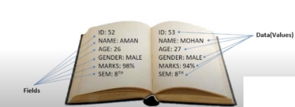

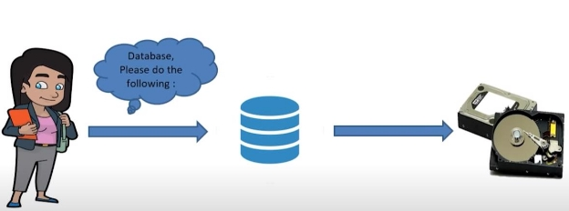

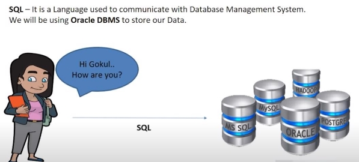

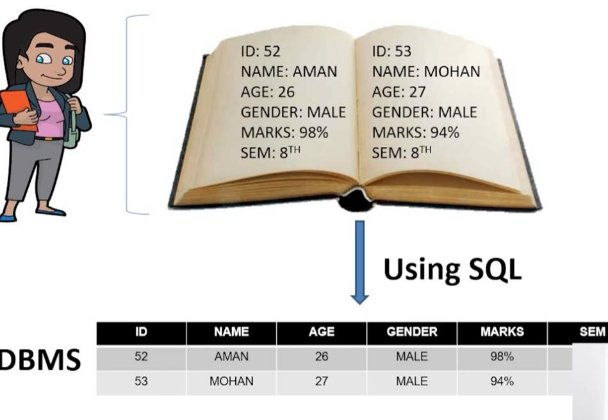

# 2. **Table Create**

**Format of the table create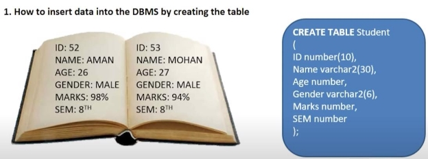**

**CREATE TABLE Student ID number(10),**

**Name varchar2(30),**

**Age number,**

**Gender varchar2(6), Marks number,**

**SEM number**

**);**

**Explain**

**CREATE TABLE   - > keyword**

**Student -> Table name**

**ID , Name , Age, Gender , Marks , Sem -> Data Type 10 , 30 ,6 -> this are the bounds or limit**

**Another Example**

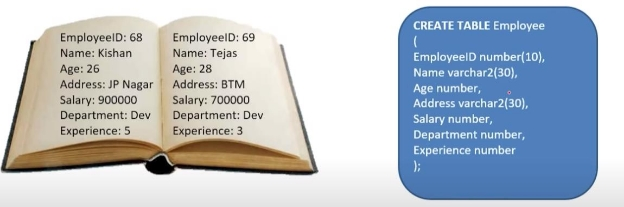

**Insert The Data into the table**

**INSERT INTO Student VALUES( 52, 'AMAN', 26, 'MALE',98, 8 ); INSERT INTO Student VALUES( 53, 'MOHAN', 27, 'MALE', 94, 8 );**

**Explain**

**INSERT INTO   - > command**

**Student -> Table name  (Use that particular table which is already created then only it can insert. You can't use student1.)**

**52, 'AMAN', 26, 'MALE',98, 8  -> id name age gender marks and same**

**and in the same manner**

**\*\*Note that If you don't put any number In their ID section. Then what happened?SQL. First, check the value. This is a number or string. So here is the Aman is a string, not a numeric value. So SQL checks and skips the number and puts there zero or null instead of Aman, so the default will be zero or null.**

**How it looks**

3. **Oracle Setup And Download**

**Download**

[Oracle 11gXE Edition Download Link](https://gist.github.com/Subham-Maity/60762ddb23083c3c1c0beca93ea1e2a3)

**Setup**

**You can put any password but remember this pass**

**You can’t open when you click on this icon what in your desktop**

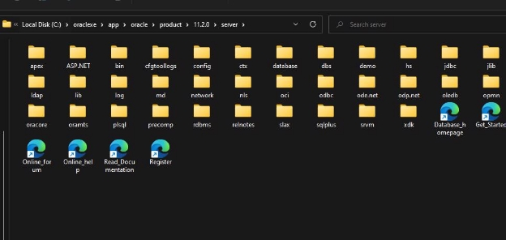

**C:\oraclexe\app\oracle\product\11.2.0\server**

[http://127.0.0.1:8080/apex/f?p=4950 ](http://127.0.0.1:8080/apex/f?p=4950) **Apply this and now click on the icon**

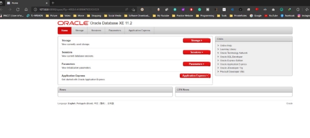

**Login and Started**

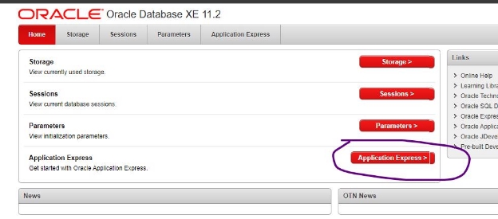

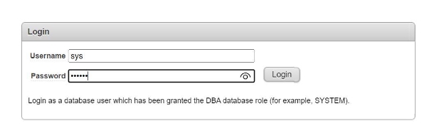

sys and password is that password when you install the setup

Password whatever you want

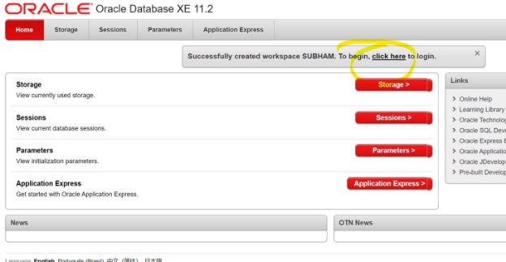

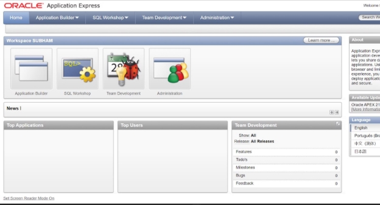

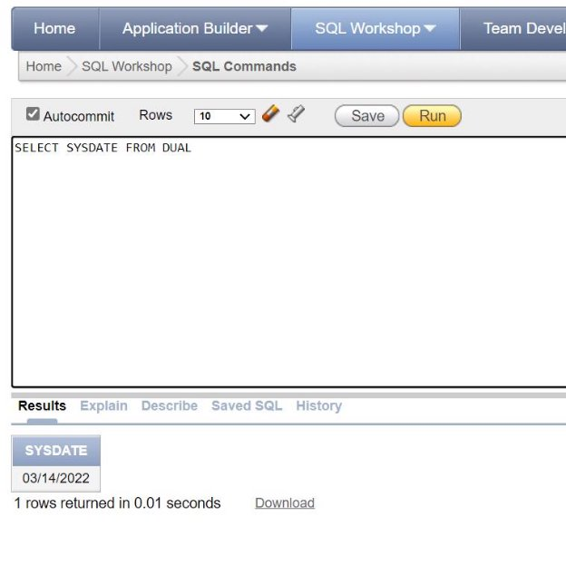

**SELECT SYSDATE FROM DUAL**

**PAGE Knowledge**

**SQL Workshop**

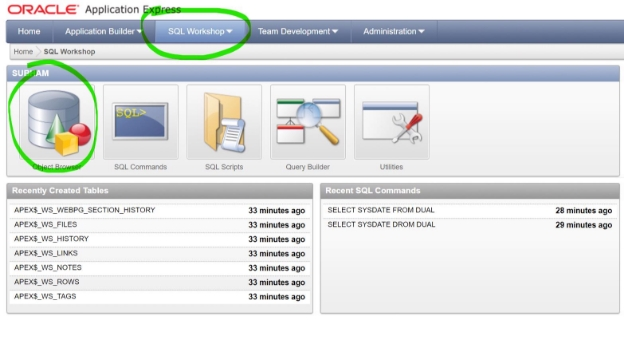

This is the emp Table which is by default

**These are the field names**

**Remains are datatype means values**

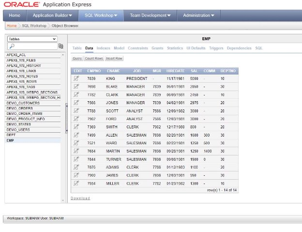

**These are all the records of my table if you want to edit you can edit from here**

**Let's see how the emp table appears in my SQL query**

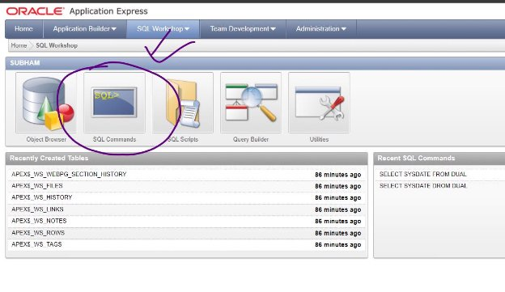

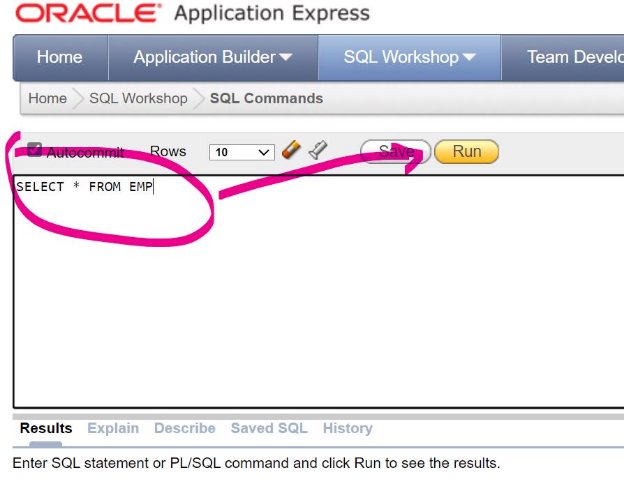

**SELECT \* FROM EMP**

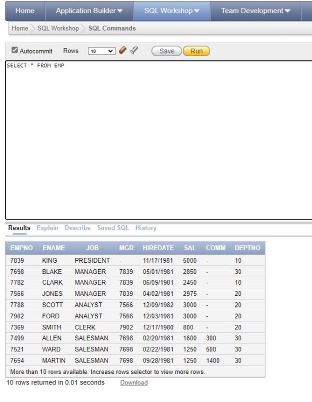 if I run it as you can see you're getting the whole data in front of you. That means the whole database, the database which are having one, one individual data, and everything is displayed here. Now you can see more than 10 rows available, increase rows selected to view more rows. That means there are more rows. And So what you have to do, you have to do it. Let's say around 200.

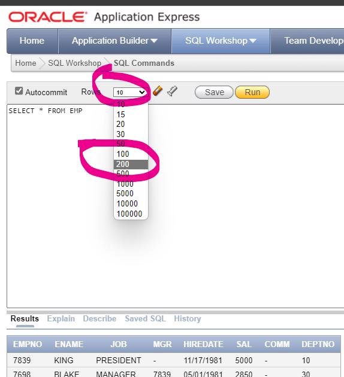

Let's run and you will see all your data. So we have 14 rules which are returned. Eight. So this is how you can play with the data. You can get all these data accordingly

4. **Table Create (EXPERIMENT)**

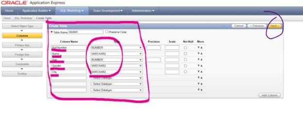

Let’s click on next and see what happen

So you have to put values

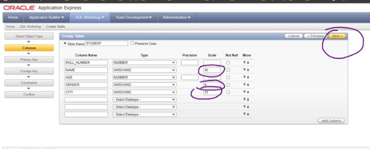

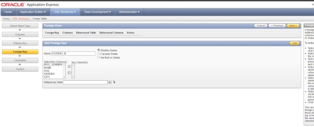

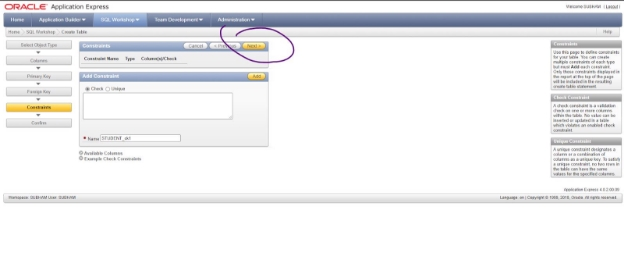

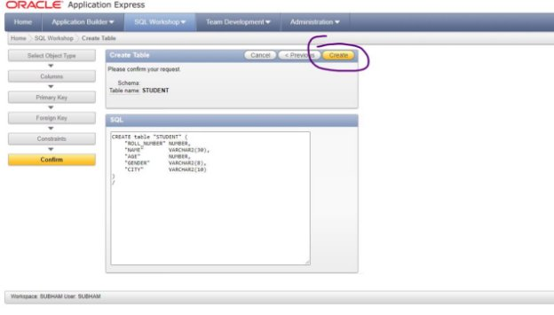

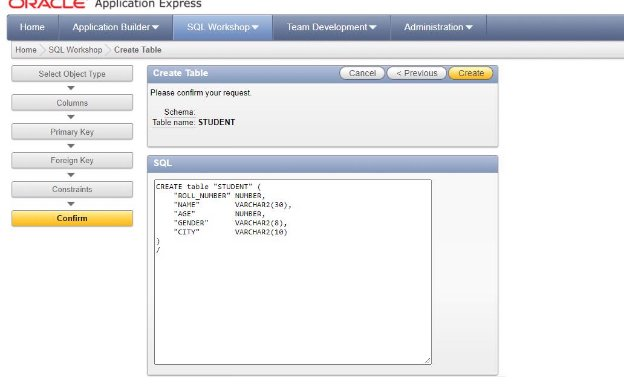

**Format**

**CREATE table "STUDENT" (**

**"ROLL\_NUMBER" NUMBER, "NAME"        VARCHAR2(30), "AGE"         NUMBER, "GENDER"      VARCHAR2(8), "CITY"        VARCHAR2(10)**

**)**

**Now what I do is just copy the query and follow my steps**

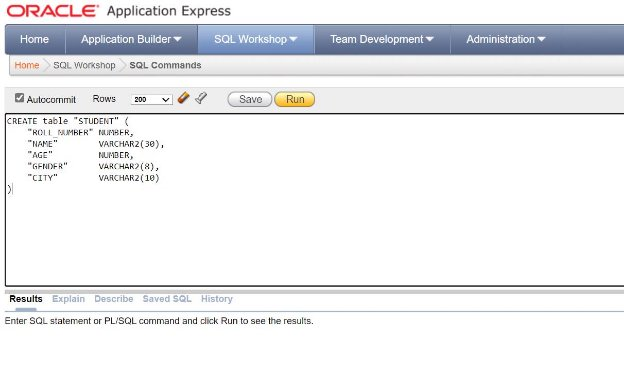

**Paste the query**

5. **Check Table (EXPERIMENT)**

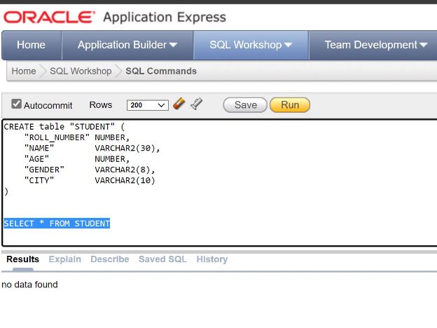

You have to select the command First then run It’s saying no data found but a table is created

So let’s check it’s true or not

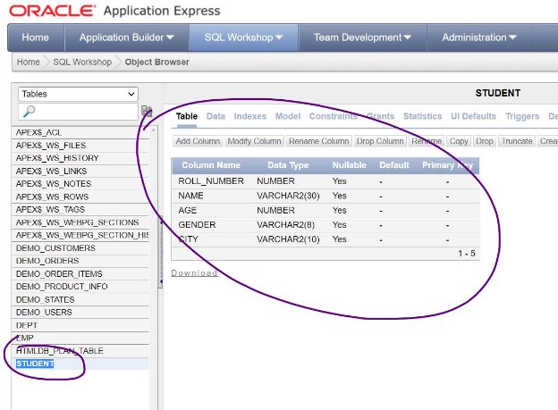

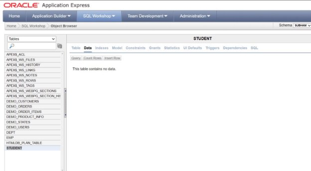

So in the data we have no data so

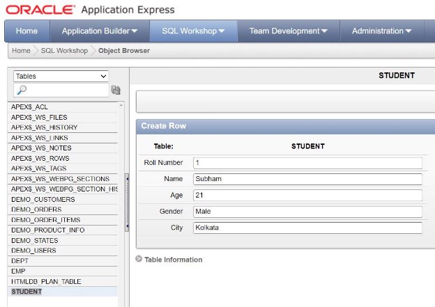

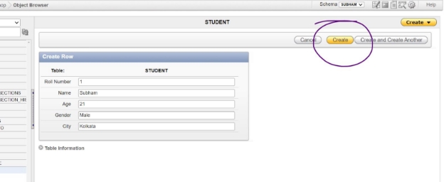

Click on the create button

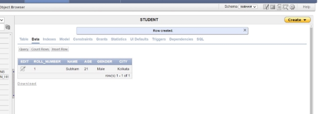

Let's create another one

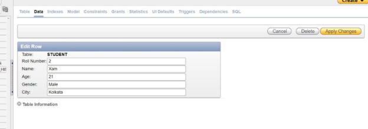

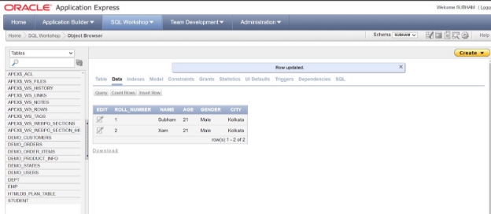

Let’s Veryfy

**Format**

SELECT \* FROM STUDENT

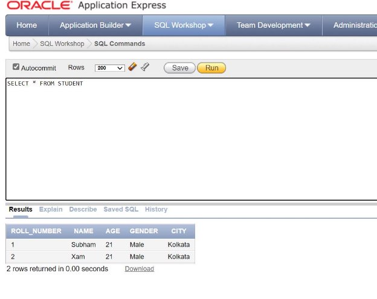

If I run I am getting the data
